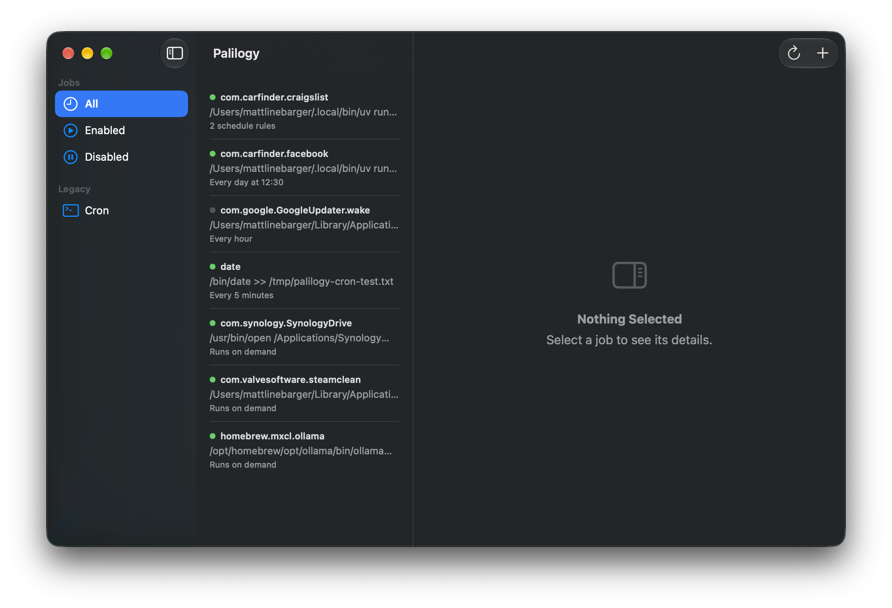
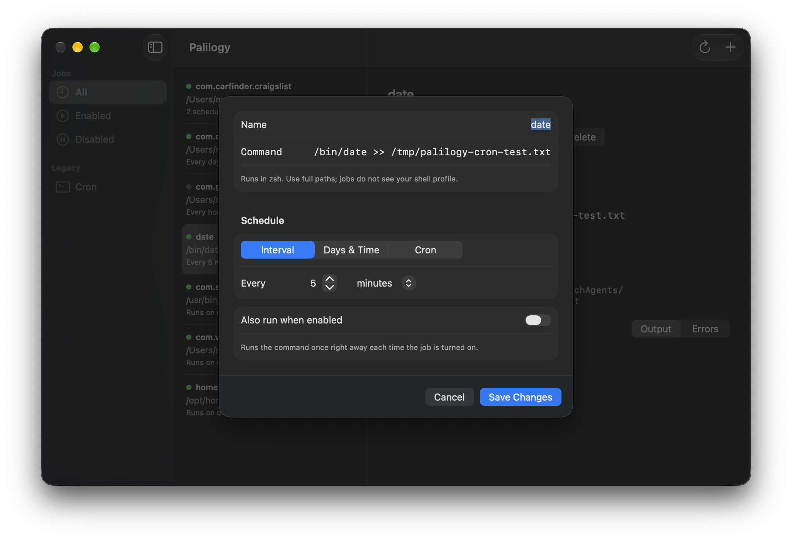
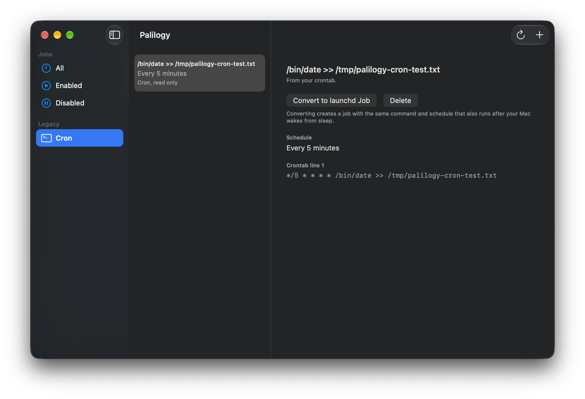

<p align="center">
  
</p>

# Palilogy

Create, view, edit, and delete scheduled jobs on your Mac from a friendly
native app.



## The name

**Palilogy** (pronounced *pa-LIL-uh-jee*) is a rhetorical device: the
deliberate repetition of a word or phrase for emphasis. It comes from the
Greek *palin* ("again," the same root as *palindrome*) and *-logia*
("speaking"). Saying it again, on purpose, because it matters.

That is also exactly what a scheduled job is: a command your Mac repeats,
deliberately, on a schedule you chose. Hence the icon, one shape said
twice.

## What it does

- **Schedule jobs without touching a plist.** Name a job, give it a
  command, pick a schedule. Palilogy writes the launchd agent, loads it,
  and shows you that it is running.
- **Three ways to describe a schedule.** A simple interval ("every 15
  minutes"), days and a time ("weekdays at 5:00"), or a cron expression
  (`0 5 * * 1-5`) for people who already think in cron. Cron input is
  translated live and fills in the visual picker when it can.
- **See everything scheduled on your Mac.** Palilogy lists every user
  LaunchAgent, including ones other apps installed, with live status:
  loaded, running, last exit code. Third-party agents can be enabled,
  disabled, or deleted, but never silently rewritten.
- **Logs built in.** Jobs created in Palilogy capture stdout and stderr to
  `~/Library/Logs/Palilogy/`, viewable right in the app. If a job failed
  at 5 a.m., the answer is one click away.
- **Cron, handled respectfully.** Your existing crontab entries are listed
  read-only. Any entry can be converted to an equivalent launchd job in
  one click, and you choose whether the original line stays or goes.
  Palilogy never creates or edits cron entries.





## Why launchd

Cron still works on macOS, but Apple has treated it as legacy for years,
and it has a real flaw on laptops: if your Mac is asleep at the scheduled
minute, the job silently never runs. launchd is the scheduler macOS
actually wants you to use. It runs missed jobs after wake, and it is what
every job Palilogy creates uses under the hood. The catch has always been
that launchd wants hand-written XML and `launchctl` incantations. Palilogy
exists so you never see either.

## Requirements

- macOS 14 (Sonoma) or later.
- Palilogy is not sandboxed, because it needs to talk to `launchctl` and
  read your crontab. For the same reason it is distributed as a signed,
  notarized DMG rather than through the Mac App Store.

## Install

Download the latest DMG from
[Releases](https://github.com/mattlinebarger/palilogy/releases) and drag
Palilogy to Applications.

### Build from source

Requires Xcode and [XcodeGen](https://github.com/yonaskolb/XcodeGen)
(`brew install xcodegen`):

```
xcodegen generate
xcodebuild -project Palilogy.xcodeproj -scheme Palilogy -configuration Debug build
```

## What it touches

Everything Palilogy does happens on your Mac; nothing is sent anywhere.

- `~/Library/LaunchAgents/`: reads all agents; writes only jobs you create
  or edit (marked with a `PalilogyManaged` key).
- `launchctl`: load, unload, and run jobs, and read their status.
- Your crontab: read via `crontab -l`. The only writes are removals you
  explicitly ask for (deleting an entry, or cleaning up after a convert).
- `~/Library/Logs/Palilogy/`: log files for jobs created in the app.

## Development

Work happens on the `dev` branch; `main` is stable. The v1 design lives in
[docs/specs/palilogy-v1.md](docs/specs/palilogy-v1.md), and UI conventions
in [docs/mac-app-styling.md](docs/mac-app-styling.md).

```
xcodebuild -project Palilogy.xcodeproj -scheme Palilogy test
```

## License

MIT. See [LICENSE](LICENSE).

Palilogy is an [Inkling Labs](https://www.inkling-labs.com) project.
